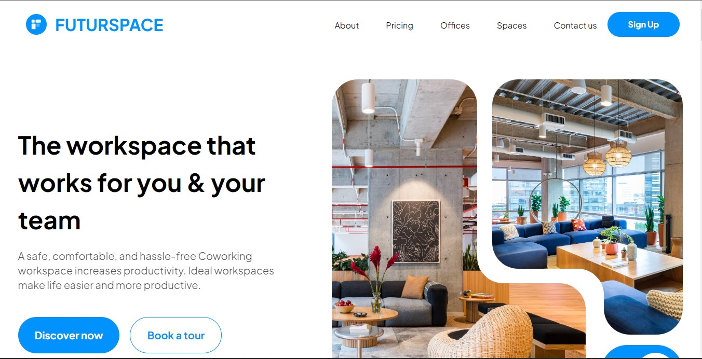

# [Futurspace](https://futurspace-teamdev2.vercel.app/)

This is Futurspace Website with React Js.

[](https://futurspace-teamdev2.vercel.app/)

## Tech Stack

- **Framework:** [React.js](https://react.dev/)
- **Bundler:** [Vite.js](https://vitejs.dev/)
- **Styling:** [Tailwind CSS](https://tailwindcss.com)

## Running Locally

1. Clone the repository

```bash
git clone https://github.com/alfinabalqis/futurespace
```

2. Install dependencies

```bash
npm install
```
   or
```bash
yarn
```

3. Start the development server

```bash
npm run dev
```
   or
```bash
yarn dev
```